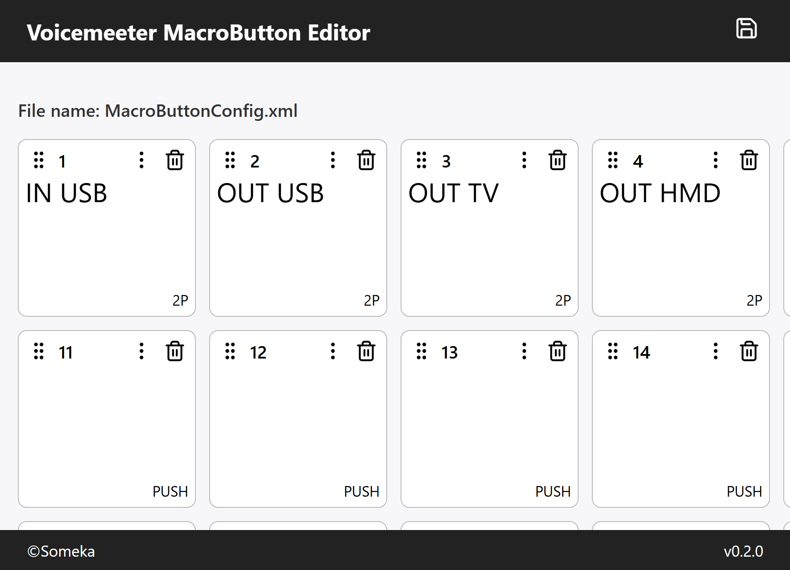

# VoiceMeeterMacroButtonEditor
GUI to edit VoiceMeeter macro button 

## Features

- Move buttons by drag and drop
- Edit button names and request scripts
- Synchronize button movement with button IDs in the request scripts

## Planned Features

- Exclusive toggle group settings
- Code palette

## Requirements

- Windows 10 or later

## How to install

- Download the .zip file from the [Release page](https://github.com/someka-vrc/voicemeeter-macrobutton-editor/releases)
- Extract the .zip file to any folder you like
- Run the .exe file